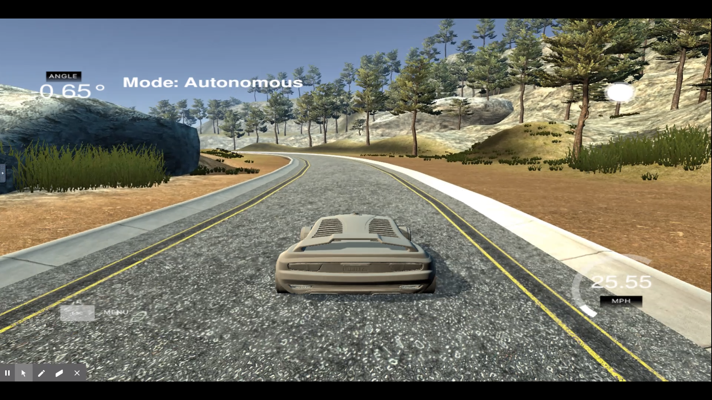
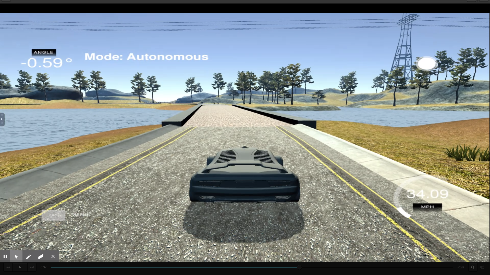
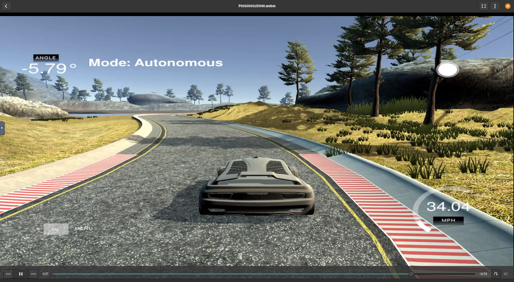
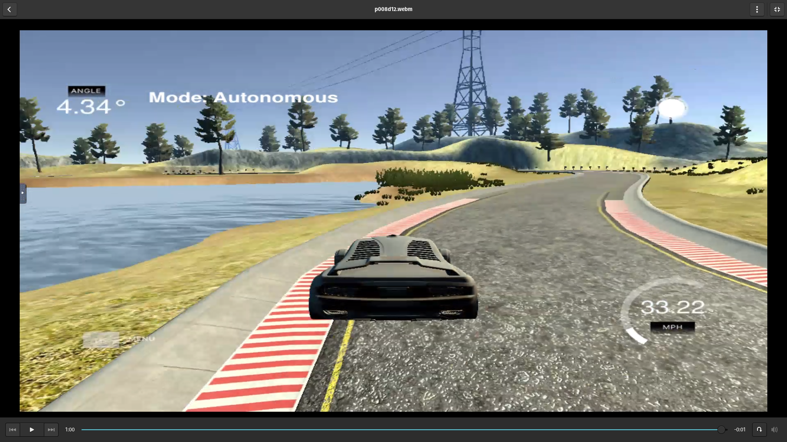
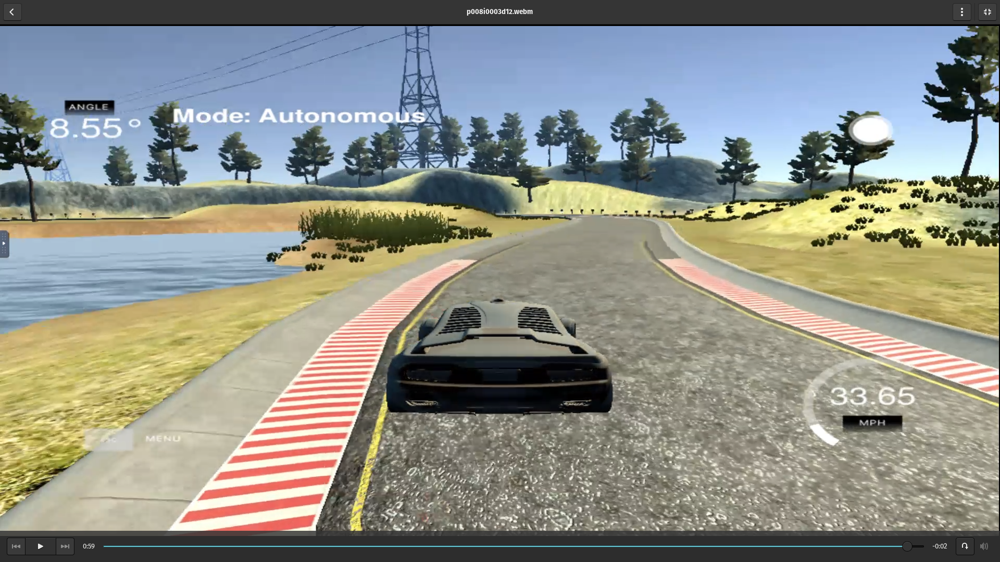

# CarND-Controls-PID
Self-Driving Car Engineer Nanodegree Program

---

## Dependencies

* cmake >= 3.5
 * All OSes: [click here for installation instructions](https://cmake.org/install/)
* make >= 4.1(mac, linux), 3.81(Windows)
  * Linux: make is installed by default on most Linux distros
  * Mac: [install Xcode command line tools to get make](https://developer.apple.com/xcode/features/)
  * Windows: [Click here for installation instructions](http://gnuwin32.sourceforge.net/packages/make.htm)
* gcc/g++ >= 5.4
  * Linux: gcc / g++ is installed by default on most Linux distros
  * Mac: same deal as make - [install Xcode command line tools]((https://developer.apple.com/xcode/features/)
  * Windows: recommend using [MinGW](http://www.mingw.org/)
* [uWebSockets](https://github.com/uWebSockets/uWebSockets)
  * Run either `./install-mac.sh` or `./install-ubuntu.sh`.
  * If you install from source, checkout to commit `e94b6e1`, i.e.
    ```
    git clone https://github.com/uWebSockets/uWebSockets 
    cd uWebSockets
    git checkout e94b6e1
    ```
    Some function signatures have changed in v0.14.x. See [this PR](https://github.com/udacity/CarND-MPC-Project/pull/3) for more details.
* Simulator. You can download these from the [project intro page](https://github.com/udacity/self-driving-car-sim/releases) in the classroom.

Fellow students have put together a guide to Windows set-up for the project [here](https://s3-us-west-1.amazonaws.com/udacity-selfdrivingcar/files/Kidnapped_Vehicle_Windows_Setup.pdf) if the environment you have set up for the Sensor Fusion projects does not work for this project. There's also an experimental patch for windows in this [PR](https://github.com/udacity/CarND-PID-Control-Project/pull/3).

## Basic Build Instructions

1. Clone this repo.
2. Make a build directory: `mkdir build && cd build`
3. Compile: `cmake .. && make`
4. Run it: `./pid`. 

Tips for setting up your environment can be found [here](https://classroom.udacity.com/nanodegrees/nd013/parts/40f38239-66b6-46ec-ae68-03afd8a601c8/modules/0949fca6-b379-42af-a919-ee50aa304e6a/lessons/f758c44c-5e40-4e01-93b5-1a82aa4e044f/concepts/23d376c7-0195-4276-bdf0-e02f1f3c665d)

## Editor Settings

We've purposefully kept editor configuration files out of this repo in order to
keep it as simple and environment agnostic as possible. However, we recommend
using the following settings:

* indent using spaces
* set tab width to 2 spaces (keeps the matrices in source code aligned)

## Code Style

Please (do your best to) stick to [Google's C++ style guide](https://google.github.io/styleguide/cppguide.html).

## Project Instructions and Rubric

Note: regardless of the changes you make, your project must be buildable using
cmake and make!

More information is only accessible by people who are already enrolled in Term 2
of CarND. If you are enrolled, see [the project page](https://classroom.udacity.com/nanodegrees/nd013/parts/40f38239-66b6-46ec-ae68-03afd8a601c8/modules/f1820894-8322-4bb3-81aa-b26b3c6dcbaf/lessons/e8235395-22dd-4b87-88e0-d108c5e5bbf4/concepts/6a4d8d42-6a04-4aa6-b284-1697c0fd6562)
for instructions and the project rubric.

## Hints!

* You don't have to follow this directory structure, but if you do, your work
  will span all of the .cpp files here. Keep an eye out for TODOs.

## Call for IDE Profiles Pull Requests

Help your fellow students!

We decided to create Makefiles with cmake to keep this project as platform
agnostic as possible. Similarly, we omitted IDE profiles in order to we ensure
that students don't feel pressured to use one IDE or another.

However! I'd love to help people get up and running with their IDEs of choice.
If you've created a profile for an IDE that you think other students would
appreciate, we'd love to have you add the requisite profile files and
instructions to ide_profiles/. For example if you wanted to add a VS Code
profile, you'd add:

* /ide_profiles/vscode/.vscode
* /ide_profiles/vscode/README.md

The README should explain what the profile does, how to take advantage of it,
and how to install it.

Frankly, I've never been involved in a project with multiple IDE profiles
before. I believe the best way to handle this would be to keep them out of the
repo root to avoid clutter. My expectation is that most profiles will include
instructions to copy files to a new location to get picked up by the IDE, but
that's just a guess.

One last note here: regardless of the IDE used, every submitted project must
still be compilable with cmake and make./

## How to write a README
A well written README file can enhance your project and portfolio.  Develop your abilities to create professional README files by completing [this free course](https://www.udacity.com/course/writing-readmes--ud777).

## Reflection

### Describe the effect each of the P, I, D components had in your implementation

First of all, PID controller in my implementation uses the following equation to calculate the ego's next steering angle in radian:


In the above equation, CTE stands for cross track error, P (proportional) component is , I (integral) component is , and D (derivative) component is . Hyperparameters for PID controller are represented as , , and . I will describe the effect of the P, I, D component in my implementation in the following.

P component will give a direct feedback from current CTE to the steering angle. So, if you want the ego to make a sharp curve, you should set a bigger value to . However, CTE will not converge with only P component. as you can see in winding move of the ego in the following video. In the video,  is set to 0.06.

[](https://youtu.be/O8rPH1UAxZ8)

D component has the effect to cancel sudden change of the steering angle. For example, if you set a bigger , the ego can make a quick curve but it's winding behavior becomes larger. You can reduce this winding behavior by setting appropriate  and make the ego can run along the course as shown in the following video. In the video,  is set to 0.90.

[](https://youtu.be/1tZxnznJi2s)

I component has the effect to reduce cumulative CTE, which will help the ego run the center of the lane during curves and adjust the bias of steering. Compared to P and I components, this component has the least impact on ego's trajectory, but very important to make smooth trajectory especially in a curve. In the following video, I set   to 0.002. If you compare this video and previous video at around 54 seconds, you will see how I component works.

[](https://youtu.be/J5G5riYrAyQ)

### Describe how the final hyperparameters were chosen

I did a manual hyperparameter tuning, and choose P=0.09, I=0.002, D=1.5 as a final hyperparameter. I didn't use any quantative metric during the hyperparameter tuning (e.g. cumulative CTE error after certain number of simulation ticks). Instead, I manually checked if the ego run along and no tire leave the drivable portion of the track surface. I tuned hyperparaemters in the following 2 steps.

First, I tried to find parameter sets which enable the ego run along the course by changing component P and D. To do this, I made an assumption that  and  have linear relationship. I actually reused the ratio of  and  which is 1:15, used in the lesson 12-7 (PD controller section). In hyperparameter tuning, I first started at (, ) = (0.001, 0.015) and increased P logarithmically, and keep the same ratio of  and . After these trials, I found the ego can run along the course with (, ) = (0.1, 1.5). However, with this parameter set, ego's jerk is little bit big, so I decreased P by 0.01 and found (, ) = (0.08, 1.2) will give the ego more smooth trajectory. However, the ego slightly run outside of the road with these parameters as shown in the below image/video.

[](https://youtu.be/YbozR_KNyyU)

So, I tried to avoid the above course out by changing I component. I tried to find a good  for the parameter set (, ) = (0.08, 1.2). I started at  = 0.001 and increased it by 0.001. This number is based on the ratio of  and  used in the lesson 12-11 PID (PID Implementation). Finally, it turned out that (, , ) = (0.08, 0.03, 1.2) will enable the ego to run along the road without course out.

[](https://youtu.be/1X3sX5307q0)